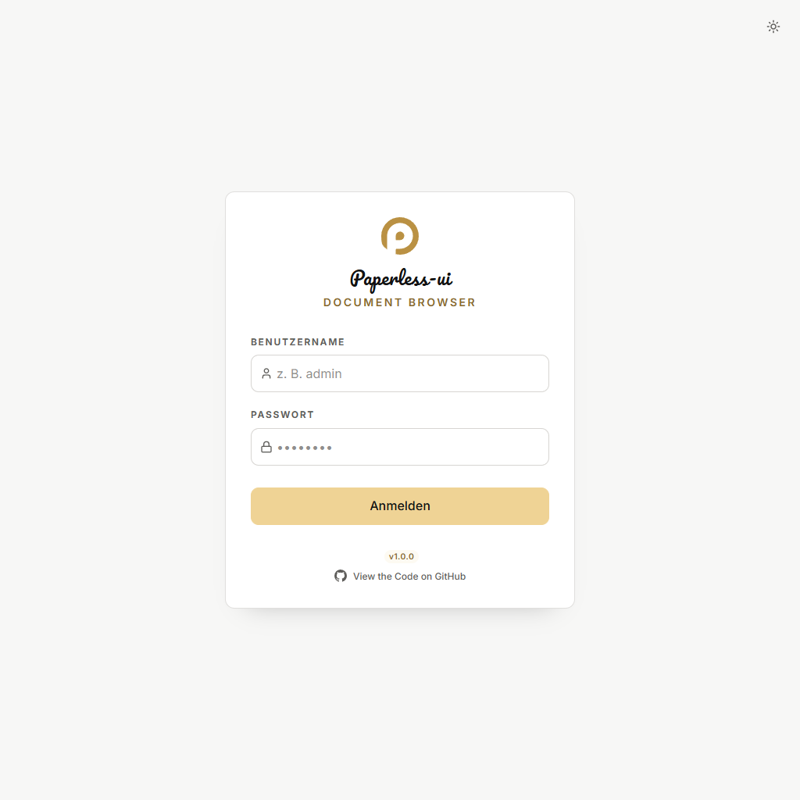
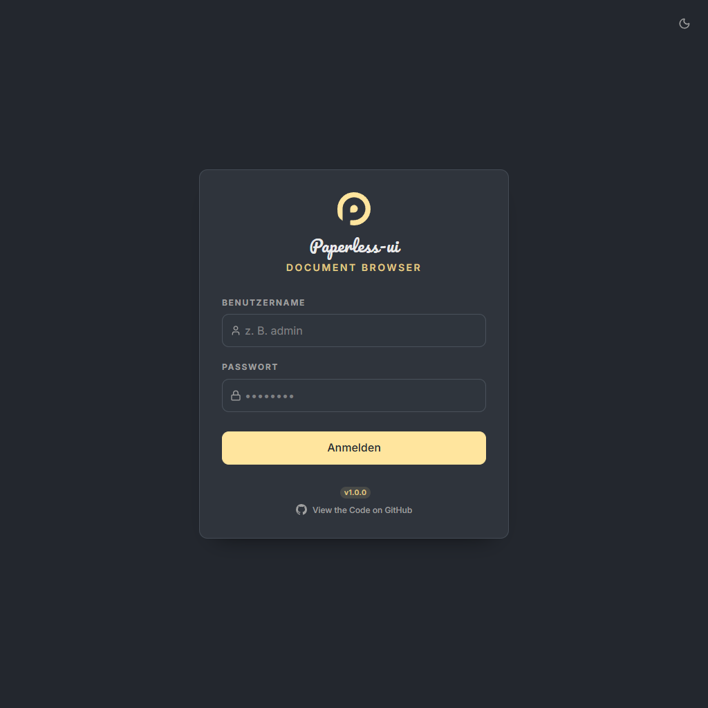
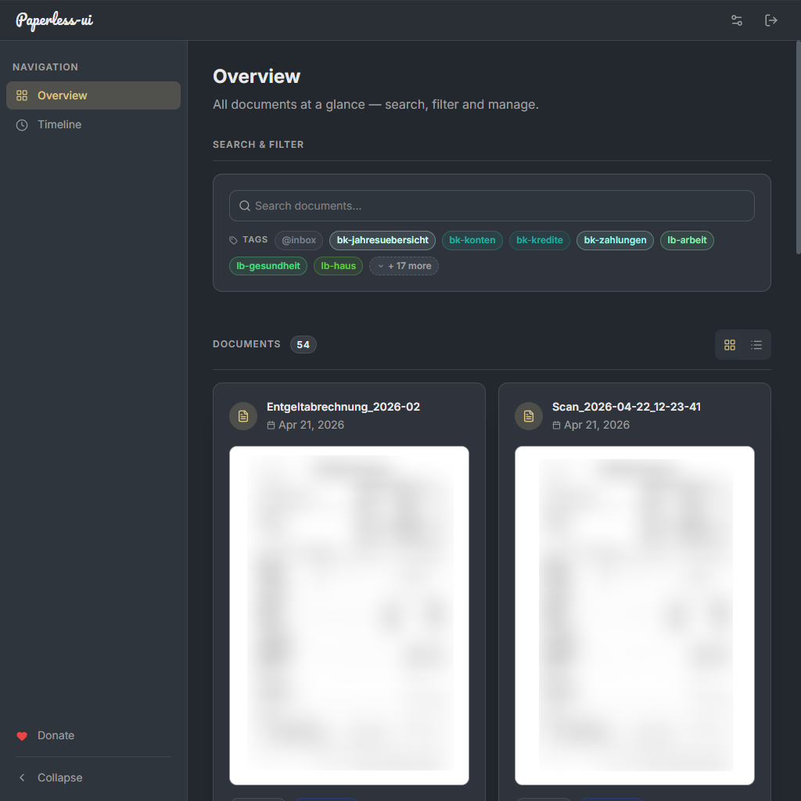
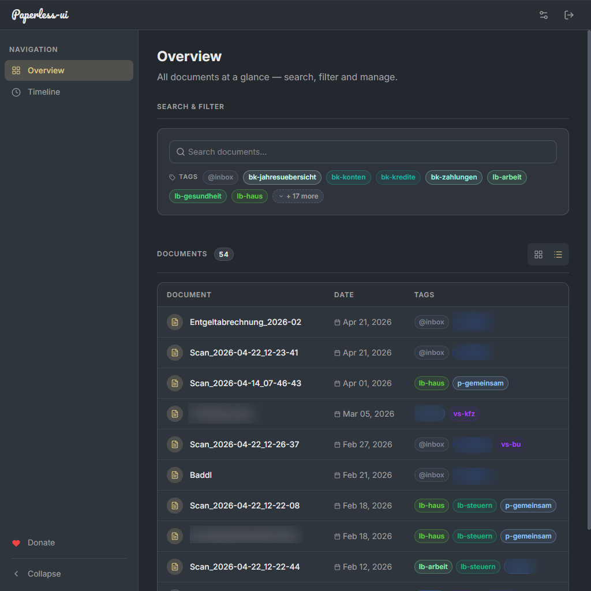
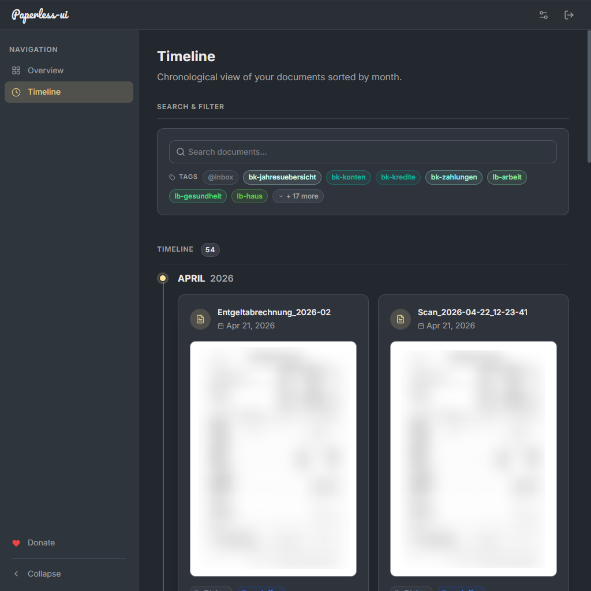
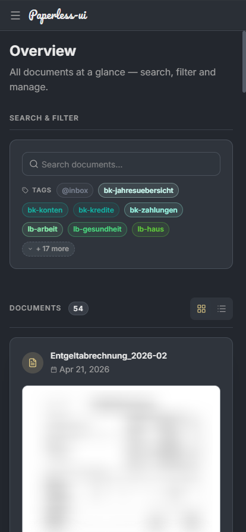
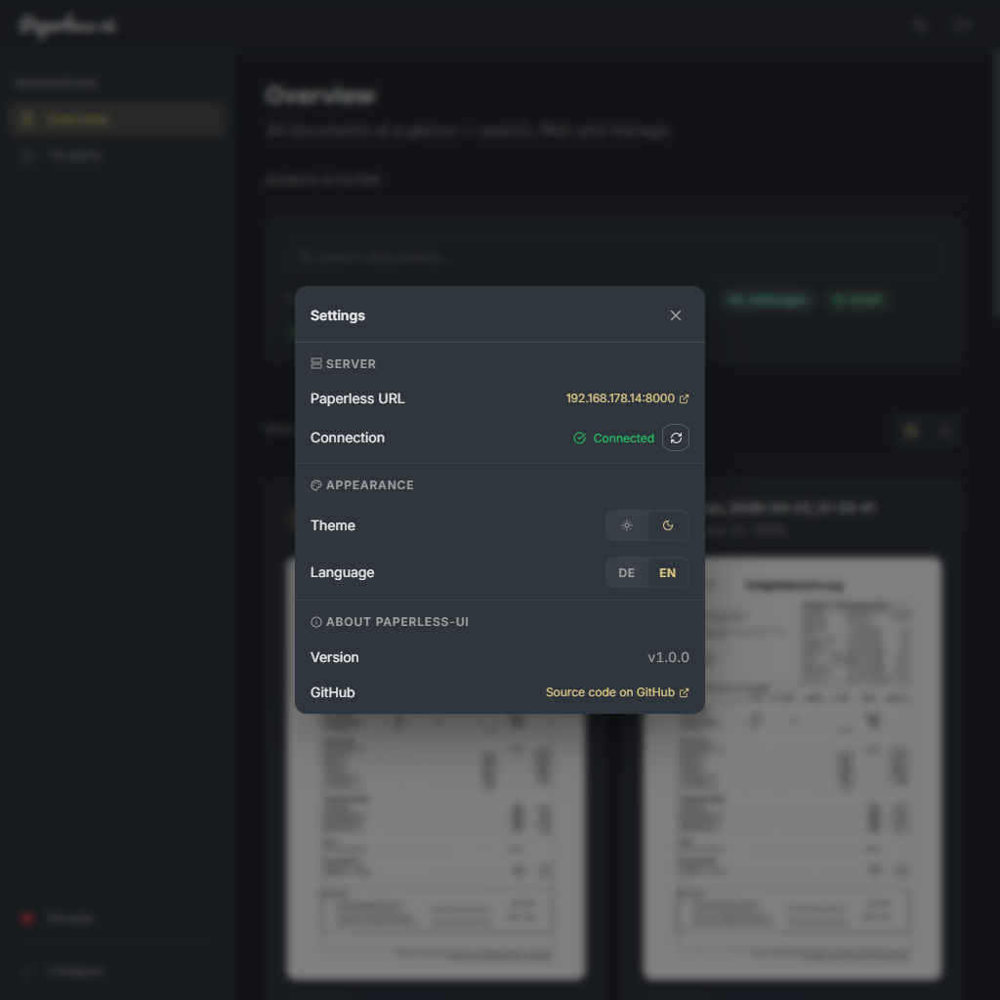
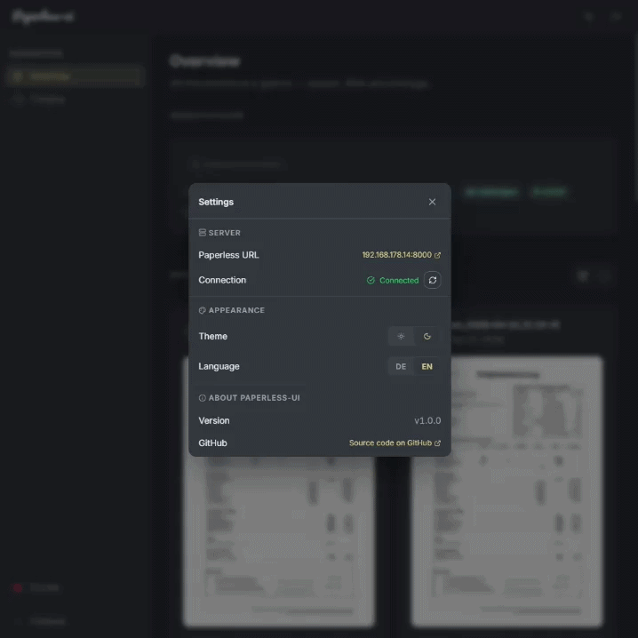

<div align="center">

# paperless-ui

**A sleek, mobile-first dashboard for [Paperless NGX](https://docs.paperless-ngx.com/)**  
Browse, search, filter, and read your documents beautifully — from any device.

[](package.json) [](LICENSE) [](Dockerfile) [](https://react.dev)

</div>

---

## 📸 Screenshots

| Light | Dark |
|---|---|
|  |  |

**🖥️ Document Grid & ☰ List View**

| Grid | List |
|---|---|
|  |  |

**🕐 Timeline & 📱 Mobile**

| Timeline | Mobile |
|---|---|
|  |  |

**⚙️ Settings Panel**



**🎬 Settings in Action**



---

## ✨ Features

### 📂 Documents
- Infinite-scroll document grid with thumbnail previews
- Full-text search across all your documents
- Filter by one or more tags simultaneously
- **Inline document renaming** — directly from the card, list row, or PDF viewer header
- Download documents directly from the viewer

### 👁️ PDF Viewer
- Pinch-to-zoom & pan support (touch and mouse)
- Multi-page navigation with page counter
- Blurred thumbnail placeholder while the PDF renders
- Zoom resets automatically on page change

### 🗂️ Navigation
- **Grid view** and **List view** toggle
- **Timeline view** — documents grouped by month and year
- Tag filter sidebar — click any tag to filter instantly

### 🎨 Design & UX
- Fully responsive — works on desktop, tablet, and mobile
- 🌞 Light and 🌙 dark theme, persisted across sessions
- Smooth animations powered by Motion (Framer Motion v12)
- ⬆️ Scroll-to-top button for long document lists
- Custom design token system with CSS variables

### 🔐 Authentication
- Token-based login proxied through a built-in Express server
- Your API token never leaves your network
- Theme preference persisted across login/logout

### 🌍 Internationalization
- 🇩🇪 German and 🇬🇧 English UI, switchable at runtime
- Language preference persisted across sessions

---

## 🚀 Getting Started

### 🐳 Docker Compose (recommended)

```yaml
services:
  paperless-ui:
    image: ghcr.io/winnicodes/paperless-ui:latest
    ports:
      - "3000:3000"
    environment:
      PAPERLESS_URL: http://your-paperless-ngx:8000
      PAPERLESS_TOKEN: your_api_token_here
```

```bash
docker compose up -d
# → Open http://localhost:3000
```

### 🛠️ Build from Source

**Prerequisites:** Node.js 20+

```bash
git clone https://github.com/winnicodes/paperless-ui.git
cd paperless-ui

npm install

# Configure environment
cp .env.example .env
# Edit .env — set PAPERLESS_URL and PAPERLESS_TOKEN

# Development
npm run dev

# Production
npm run build && npm start
```

---

## ⚙️ Configuration

| Variable | Required | Description |
|---|:---:|---|
| `PAPERLESS_URL` | ✅ | Base URL of your Paperless NGX instance (e.g. `http://192.168.1.10:8000`) |
| `PAPERLESS_TOKEN` | ✅ | Paperless NGX API token — find it under **Settings → API Token** |
| `PORT` | ➖ | Port for the Express server (default: `3000`) |

---

## 🏗️ Architecture

```
┌─────────────────────────────┐
│   Browser  (React + Vite)   │
└────────────┬────────────────┘
             │  /api/*
             ▼
┌─────────────────────────────┐
│  Express Server (Node.js)   │  ← attaches PAPERLESS_TOKEN
└────────────┬────────────────┘
             │  HTTP
             ▼
┌─────────────────────────────┐
│   Paperless NGX Instance    │
└─────────────────────────────┘
```

The Express server acts as a thin auth proxy — your API token is never exposed to the browser.

---

## 🧰 Tech Stack

| Layer | Technology |
|---|---|
| ⚛️ Frontend | React 19, TypeScript, Vite 6 |
| 🎨 Styling | Tailwind CSS v4, custom CSS design tokens |
| 🎞️ Animations | Motion (Framer Motion v12) |
| 🔣 Icons | Lucide React |
| 📄 PDF Rendering | react-pdf (PDF.js) |
| 🔍 Zoom | react-zoom-pan-pinch |
| 🌐 HTTP | Axios |
| 🖥️ Backend | Express 4, Node.js |
| 🐳 Container | Docker (multi-stage build) |

---

## 🗺️ Roadmap

| Status | Feature |
|:---:|---|
| 🔜 | **Share button** — Share a document link directly from the viewer |
| 🔜 | **Edit tags on documents** — Add and remove tags without leaving the UI |
| 🔜 | **Sub-tag display** — Visualize nested tag hierarchies in the sidebar and on cards |
| 🔜 | **Timeline date filter** — Date-range filter on the timeline for quick period browsing |
| 🔜 | **Pluggable i18n** — Easy-to-extend translation system for community languages |

---

## ☕ Support

If you find paperless-ui useful, consider supporting the project:

[](https://ko-fi.com/winnicodes)

---

## 📜 License

MIT — see [LICENSE](LICENSE) for details.

<div align="center">
Made with ❤️ for the self-hosting community
</div>
